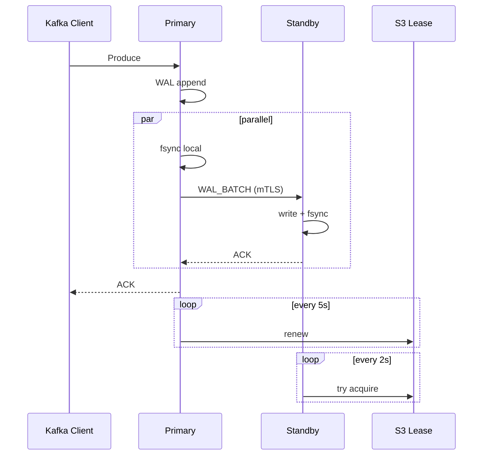

klite supports an optional standby replica for automatic failover. A primary streams its WAL to a standby over mTLS. The standby replays entries locally but doesn't accept client connections until it's promoted. Promotion happens automatically when the primary loses its S3 lease, whether from a crash, a rolling update, or a hardware failure.

When replication is not configured, klite runs in single-node mode exactly as before. Everything described here requires `--replication-addr` to be set.

## How it works

The primary holds an S3 lease object and accepts all Kafka client traffic. It streams every WAL entry and metadata change to the standby over mTLS in real time. The standby writes these to its own local WAL and builds its in-memory indexes as entries arrive, so it's immediately ready to serve on promotion with no replay delay.

### Produce ACK flow



The client doesn't see any of this complexity. From its perspective, produce latency is `max(local_fsync, network_rtt + remote_fsync)`. Both fsync operations happen in parallel, so replication adds only the network round-trip on top of the local write, typically 1-2ms on the same network.

## Zero data loss

The primary does not acknowledge a produce request until two things happen:

1. The local WAL entry is fsync'd to disk.
2. The standby confirms it has also fsync'd the same entry.

These two operations happen in parallel. Produce latency is `max(local_fsync, network_rtt + remote_fsync)`, on the same network typically 2-4ms, barely worse than single-node mode.

If the primary crashes, every acknowledged record exists on the standby's disk. Nothing that was confirmed to a client can be lost.

Metadata (topic creation, consumer group offsets) is streamed asynchronously and is self-healing. Consumer offsets are recommitted by clients within seconds via auto-commit.

## Fencing with S3

Split-brain is the hard problem in any failover system. klite solves it without adding new infrastructure by using S3 conditional writes (`PutObject` with `If-Match`) as a distributed lock.

The primary holds a lease object in the S3 bucket and renews it every 5 seconds. If it can't renew (crash, network partition, S3 failure lasting longer than the lease duration), the lease expires and the standby claims it. Only the node holding the lease accepts writes. Since S3 conditional writes are strongly consistent, two nodes can never both believe they hold the lease.

This is the same S3 bucket klite already uses for data storage. No additional dependencies: no etcd, no ZooKeeper, no DynamoDB.

### Failover timing

| Scenario | Downtime | Data loss |
|----------|----------|-----------|
| Graceful shutdown (SIGTERM) | ~2 seconds | Zero |
| Crash (SIGKILL, OOM, hardware) | ~17 seconds | Zero |
| Standby crash | None (primary continues) | Zero |

On graceful shutdown, the primary explicitly releases the lease after draining all in-flight requests. The standby detects this on its next poll (~2 seconds). On a crash, the lease expires naturally after 15 seconds, plus up to 2 seconds for the standby to detect it.

## Replication behavior

Replication is always synchronous: produce fails with `KAFKA_STORAGE_ERROR` if the standby doesn't acknowledge within the timeout (`--replication-ack-timeout`, default 5s). This preserves the zero-data-loss guarantee.

**Bootstrap exception:** until the first standby connects (completes the HELLO handshake), produces succeed with local fsync only. Once a standby has connected, sync enforcement activates. If the standby subsequently disconnects, produces fail.

## Auto-generated TLS

The replication channel uses mutual TLS. Since both brokers already have access to the same S3 bucket, klite uses it as a simple PKI: the first primary generates a CA and node certificate, uploads them to S3, and the standby downloads them before connecting.

```
<prefix>/repl/ca.crt
<prefix>/repl/ca.key
<prefix>/repl/node.crt
<prefix>/repl/node.key
```

Both nodes use the same keypair. The mTLS handshake verifies that both sides trust the auto-generated CA, which is sufficient to prevent unauthorized connections to the replication port. No manual certificate setup, no cert-manager, no flags. It just works because S3 is already there.

## Standby behavior

The standby is purely passive:

- Receives WAL and metadata entries from the primary
- Writes them to its own local WAL and metadata log
- Builds WAL indexes and ring buffers (ready to serve immediately on promotion)
- Does **not** accept Kafka client connections
- Does **not** flush to S3, run compaction, or run retention

On promotion, the standby starts the Kafka TCP listener and begins serving clients. Kafka clients reconnect automatically since retries are the default in all major client libraries.

## Failure scenarios

### Network partition

Both nodes are alive but can't see each other. The primary attempts lease renewal via S3. If S3 is reachable from the primary, it stays primary (but produces fail in sync mode since the standby is unreachable). If S3 is unreachable from the primary, the lease expires and the primary demotes itself. The standby can only promote if it can reach S3 to claim the lease. Split-brain is impossible because the S3 lease is the single arbiter.

### Standby crashes

The primary's next replication attempt fails. In sync mode, produces fail until the standby reconnects. In async mode, produces continue with local fsync only. When the standby restarts, it reconnects and catches up automatically.

### Both nodes restart

Both start as standbys and compete for the S3 lease. Exactly one wins and becomes primary. The other connects as standby and catches up.
